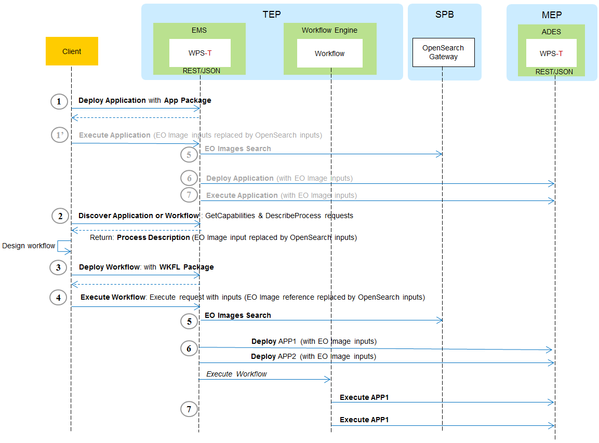

== Chapter 7. Conclusions

=== 7.3 Sequence of Operations

This section provides the steps of the sequence of operations required for deploying and executing both applications and workflows:

1. Alice deploys a newly developed application
2. Alice's sister discovers the new application and builds a workflow including that application.
3. Alice's sister deploys the workflow.
4. Bob discovers the new workflow and executes it.

The execution of workflow or an application on the EMS internally includes the following steps:

[start=5]
5. EO Image Discovery.
6. Deployment on ADES.
7. Execution on ADES.

Note that the security, quoting, and billing aspects are not covered here as they belong to the scope of the D010 Engineering Report. 

The sequence of operations is shown on the diagram below.

The execution of the application (step 1') is not covered explicitely as the steps (steps 5, 6 and 7) are similar to the execution of the workflow excepted that the EMS is only a broker in front of the ADES.

==== 7.3.1 Application deployment (Step 1)

Alice developed an application identified as 'MultiSensorNDVI'. She wants to make this application available to the users of the Thematic Exploitation Platform.

Using the EMS Client, Alice performs a Deployment request (step 1). The WPS-T REST HTTP POST operation path is _/processes_ , and the request message includes the following items:

* The Process Description: a standard (WPS) description of the application interface used by the client. In particular, it includes a project-specific flag (EOImage) for Earth Observation Image inputs, and it also references a CWL file providing information on the Docker image of the application. 
* The Execution Unit: the application binaries, packages and resources which is, in this case, a reference to the Docker image.
* The identifier of the Profile (in this case, a Dockerized application).

[source,json]
----
{
    "processDescription": {
        "process": {
            "id": "NDVIMultiSensor",
            "title": "NDVIMultiSensor",
            "owsContext": {
                "offering": {
                    "code": "http://www.opengis.net/eoc/applicationContext/cwl",
                    "content": {
                        "href": "https://some-host/CWL/NDVIMultiSensor.cwl"
                    }
                }
            },
            "abstract": "Normalized Difference Vegetation Index (NDVI) from an input list of satellite images.",
            "keywords": ["NDVI"],
            "inputs": [
                {
                    "id": "files",
                    "title": "Input Image",
                    "formats": [
                        {
                            "mimeType": "application/zip",
                            "default": true
                        },{
                            "mimeType": "application/x-hdf"
                        }
                    ],
                    "minOccurs": "1",
                    "maxOccurs": "unbounded",
                    "additionalParameters": [
                        {
                            "role": "http://www.opengis.net/eoc/applicationContext/inputMetadata",
                            "parameters": [
                                {
                                    "name": "EOImage",
                                    "values": ["true"]
                                }
                            ]
                        }
                    ]
                }
            ],
            "outputs": [
                {
                    "id": "output",
                    "title": "NDVI Images",
                    "formats": [
                        {
                            "mimeType": "image/tiff",
                            "default": true
                        }
                    ]
                }
            ]
        },
        "processVersion": "1.0.0",
        "jobControlOptions": [
            "async-execute"
        ],
        "outputTransmission": [
            "reference"
        ]
    },
    "immediateDeployment": true,
    "executionUnit": [{
            "href": "docker.registry/ndvims:latest"
        }],
    "deploymentProfileName": "http://www.opengis.net/profiles/eoc/dockerizedApplication"
}
----

The client then receives an acknowledgment of the successful deployment of the process as illustrated below.

[source,json]
----
{
  "processSummary": {
    "id": "MultiSensorNDVI",
    "title": "Multi Sensor NDVI",
    "abstract": "NDVI is calculated after the two bands values Near Infrared and red. It is calculated by this formula : NDVI = (NIR-Red)/(NIR+Red)",
    "keywords": [
      "NDVI"
    ],
    "version": "1.0.0",
    "jobControlOptions": [
      "async-execute"
    ],
    "processDescriptionURL": "http://some.domain/wps/processes/MultiSensorNDVI"
  }
}
----

==== 7.3.2 Application discovery and workflow design (Step 2)

Alice's sister is preparing a processing chain workflow. She first needs to discover the applications available on the Thematic Exploitation Platform (step 2). 
The EMS Client can list a summary of the available processes. 

The WPS-T REST HTTP GET operation path is _/processes_ and the response is illustrated below.

[source,json]
----
{
  "processes": [
    {
      "id": "NDVIMultiSensor",
      "title": "NDVIMultiSensor",
      "jobControlOptions": [
        "async-execute"
      ],
      "outputTransmission": [
        "reference"
      ],
      "processDescriptionURL": "http://185.52.193.7/wps-proxy/processes/GeomatysNDVIMultiSensor"
    },
    {
      "id": "NDVIStacker",
[...]
  ]
}
----

The chosen language for the workflow is CWL. Therefore, for each application that Alice plans to include, the CWL file of the application needs to be retrieved by the client using a description process operation.

The WPS-T REST HTTP GET operation path is _/processes/{processId}_ and the response illustrated below includes the CWL reference which was provided in the OWS Context element during deployment.

[source,json]
----
{
  "process": {
    "id": "NDVIMultiSensor",
    "title": "NDVIMultiSensor",
    "abstract": "Normalized Difference Vegetation Index (NDVI) from an input list of satellite images.",
    "owsContext": {
      "offering": {
        "code": "http://www.opengis.net/eoc/applicationContext/cwl",
        "content": {
          "href": "https://some-host/CWL/NDVIMultiSensor.cwl"
        }
      }
    },
 [...]
  },
  "processVersion": "1.0.0",
  "jobControlOptions": [
    "async-execute"
  ],
  "outputTransmission": [
    "reference"
  ]
}
----

Note that the input and output description parts have been hidden from the example and will be covered in the workflow execution step (step 4).

Alice's sister can compose her CWL workflow using her prefered CWL workflow designer tool (e.g. Rabix Composer) and import the various applications CWL files for building the workflow steps.

Before deploying the workflow generated by the design tool, the run property must be verified to ensure that:

* The CWL file path should be resticted to the file name.
* The CWL file name must be to process identifier (defined in the WPS Process Description).

[source,json]
----
   "steps":{  
      "myOwnStep":{  
         "run":"NDVIMultiSensor.cwl",
         "in":{  
            "files":"myWorkflowInput"
         },
         "out":[  
            "myOutput"
         ]
      },
----

==== 7.3.3 Workflow Deployment (Step 3)

Alice's sister composed the Multi Sensor NDVI Stack Generator processing chain. The chain performs a Multi Sensor NDVI processing on each of the 3 received EO Image inputs then Stack the generated outputs, as illustrated on the diagram below.

image::multisensorNDVIworkflow.png[]

Alice's sister prepares the WPS Process Description for deploying the processing chain workflow, and uses the client to perform the deployment request. The WPS-T REST HTTP POST operation path is _/processes_ and the request is shown below.

[source,json]
----
{
    "processDescription": {
        "process": {
            "id": "MultiSensorNDVIStackGenerator",
            "title": "MultiSensorNDVIStackGenerator",
            "abstract": "",
            "keywords": [],
            "inputs": [
                {
                    "id": "image-collection1",
                    "title": "Input Image",
                    "formats": [
                        {
                            "mimeType": "application/zip",
                            "default": true
                        }
                    ],
                    "minOccurs": 1,
                    "maxOccurs": "unbounded",
                    "additionalParameters": [
                        {
                            "role": "http://www.opengis.net/eoc/applicationContext/inputMetadata",
                            "parameters": [
                                {
                                    "name": "EOImage",
                                    "values": [
                                        "true"
                                    ]
                                }
                            ]
                        }
                    ]
                },
                {
                    "id": "image-collection2",
                    [...]
                },
                {
                    "id": "image-collection3",
                    [...]
                } 
            ],
            "outputs": [
                {
                    "id": "output",
                    "title": "Stacked Image",
                    "formats": [
                        {
                            "mimeType": "image/tiff",
                            "default": true
                        }
                    ]
                }
            ]
        },
        "processVersion": "1.0.0",
        "jobControlOptions": [
            "async-execute"
        ],
        "outputTransmission": [
            "reference"
        ]
    },
    "executionUnit": [
        {
            "href": "https://some-host/CWL/MultiSensorStackGenerator.cwl"
        }
    ],
    "deploymentProfileName": "http://www.opengis.net/profiles/eoc/workflow"
}
----

The client receives a similar deployment confirmation message as described earlier.

==== 7.3.4 Workflow Execution (Step 4)

Bob tries to discover the applications and workflows available on the Thematic Exploitation Platform in order to perform an execution (step 4). The EMS Client can list the available processes using the _/processes_ REST path as already mentioned earlier.

When a WPS Process Description is requested by the EMS client, the returned document differs from the one that was submitted by Alice. Indeed, the description of EO Image input is replaced by fields required to perform a OpenSearch Catalog query. The EMS is responsible to retrieve the EO Image references by performing a Catalog search and pass the returned products URLs. Therefore, the process description returned by the EMS looks as illustrated below.

The WPS-T REST HTTP GET operation path is _/processes/{processId}_ and the response is displayed below. In that example, the inputs _image-collection1_, _image-collection2_, and _image-collection3_ were replace by the fields os_aoi, os_startDate, os_endDate, and 3 other inputs for the collection identifier.

[source,json]
----
{
  "process": {
    "id": "MultiSensorNDVIStackGenerator",
    "title": "MultiSensorNDVIStackGenerator",
    "abstract": "",
    "owsContext": {
      "offering": {
        "code": "http://www.opengis.net/eoc/applicationContext/cwl",
        "content": {
          "href": "https://some-host/multiSensorNDVIStacker.cwl"
        }
      }
    },
    "inputs": [
      {
        "id": "os_collectionId_image-collection1",
        [...]
      },
      {
        "id": "os_collectionId_image-collection2",
        [...]
      },
      {
        "id": "os_collectionId_image-collection3",
        [...]
      },
      {
        "id": "os_startDate",
        [...]
      },
      {
        "id": "os_endDate",
        [...]
      },
      {
        "id": "os_aoi"
        [...]
      }
    ],
 [...]
  }
}

----

Bob execute the workflow by submitting an execute request. The WPS-T REST HTTP POST operation path is _/processes/{processId}/jobs_.

[source,json]
----
{
  "mode": "async",
  "response": "document",
  "inputs": [
    {
      "id": "os_collectionId_image-collection1",
      "data": "EOP:IPT:Sentinel2"
    },
    {
      "id": "os_collectionId_image-collection2",
      "data": "urn:ogc:def:EOP:VITO:PROBAV_P_V001"
    },
    {
      "id": "os_collectionId_image-collection2",
      "data": "DE2_MS4_L1B"
    },
    {
      "id": "os_aoi",
      "data": "100.4,18.3,104.6,19.3"
    },
    {
      "id": "os_startDate",
      "data": "2018-01-30T00:00:00.000Z"
    },
    {
      "id": "os_endDate",
      "data": "2018-01-31T23:00:59.000Z"
    }
  ],
  "outputs": [
    {
      "id": "output",
      "transmissionMode": "reference"
    }
  ]
}
----

The execution is confirmed by an HTTP 201 response code, and includes the status document URL in the "Location" HTTP header.

The WPS-T REST HTTP GET operation path is _/processes/_{processId}_/jobs/{jobId}_.  The status shall be polled until the state is succeeded (or failed) as shown below.

[source,json]
----
{
"status":"succeeded",
"message":"Status of job 35efcdb8-7447-46bb-8338-2e706d1cfece",
"jobId":"35efcdb8-7447-46bb-8338-2e706d1cfece"
}
----

For retrieving the Result document, the WPS-T REST HTTP GET operation path is _/processes/_{processId}_/jobs/{jobId}/result_. Typically the result outputs are provided by reference to avoid retrieving files to the EMS between all the steps.

[source,json]
----
{  
   "outputs":[  
      {  
         "mimeType":"image/tiff",
         "href":"http://some-host/WPS/xxxYYY",
         "id":"output"
      }
   ]
}
----

==== 7.3.5 EMS Execution Steps

The approaches for performing a workflow or an application execution are specific to the EMS implementation. However, the implementation always includes the three steps detailed further.

===== OpenSearch Catalog (Step 5)

As mentioned above, the EMS replaces the EO Image inputs with OpenSearch query fields (collection identifier, area of interest and time of interest). They are used by the EMS for searching the products URLs on the Gateway. The Gateway is based on the  OGC OpenSearch Extension for Earth Observation specification (OGC 13-026r8) and OpenSearch Geo and Time Extensions (OGC 13-032r8).

In the context of Testbed 14, the OpenSearch Gateway developed by Spacebel is in front of the three MEP catalogs and is configured with the following collections:

* EOP:IPT:Sentinel2
* urn:ogc:def:EOP:VITO:PROBAV_P_V001
* PROBAV_S1-TOA_1KM_V001
* DE2_PS3_L1C

The first steps for retrieving EO Image references is to search for the provided collection. The collection identifier is supplied in the WPS-T REST HTTP GET operation path _http://geo.spacebel.be/opensearch/request?uid={collectionId}_.

The operation returns the list of collection entries matching with this collection identifier. For each entry, it includes a reference to the OpenSearch document that describes the collection search engine in atom:feed/atom:link[@rel=’search’][@type=‘application/opensearchdescription+xml‘].

The EMS then retrieves the OpenSearch Description Document (OSDD) for the requested collection. In the context of Testbed 14, the first step can be skipped, because the OSDD reference may be retrieved using the WPS-T REST HTTP GET operation path _http://geo.spacebel.be/opensearch/description.xml?parentIdentifier={collectionId}_.

The Collection OSDD document defines in particular the search template for the product query request in atom:entry/atom:link[@rel=’search’] with @type=’application/atom+xml’, as illustrated below.

[source,xml]
----
<Url indexOffset="1" pageOffset="1" rel="results" template="http://geo.spacebel.be/opensearch/request?httpAccept=application%2Fatom%2Bxml&amp;parentIdentifier=EOP:SSARA&amp;query={searchTerms?}&amp;startDate={time:start?}&amp;endDate={time:end?}&amp;geometry={geo:geometry?}&amp;platform={eo:platform?}&amp;orbitNumber={eo:orbitNumber?}&amp;frame={eo:frame?}&amp;sensorMode={eo:sensorMode?}&amp;swathIdentifier={eo:swathIdentifier?}&amp;orbitDirection={eo:orbitDirection?}&amp;antennaLookDirection={eo:antennaLookDirection?}&amp;polarisationChannels={eo:polarisationChannels?}&amp;processingLevel={eo:processingLevel?}&amp;maximumRecords={count?}&amp;uid={geo:uid?}&amp;name={geo:name?}&amp;lat={geo:lat?}&amp;lon={geo:lon?}&amp;radius={geo:radius?}&amp;recordSchema={sru:recordSchema?}&amp;bbox={geo:box?}&amp;startRecord={startIndex?}&amp;strict=true" type="application/atom+xml">		
----

The EMS builds the product search request path from the template by setting null values for unused fields and by setting the following parameter values:

* geo:box : AOI
* time:start : TOI start date
* time:end : TOI end date

The WPS-T REST HTTP GET operation path may look similar to http://geo.spacebel.be/opensearch/request?parentIdentifier={collectionId}&startDate={toi_start}&endDate={toi_end}&bbox={aoi}&httpAccept=application/atom%2Bxml

Finally, the returned document is a list of entries that include as shown below:

* The link to the products: in atom:entry/atom:link[@rel=`enclosure`]
* The associated WPS endpoint: in atom:entry/owc:offering/owc:operation[@code=`Execute`]/@href

[source,xml]
----
<link href=""http://185.48.233.249/Sentinel-2/MSI/L1C/2018/01/30/S2B_MSIL1C_20180130T034959_N0206_R104_T47PPT_20180130T064159.SAFE" rel="enclosure" title="Download" type="application/x-binary"/>
<owc:offering code="http://www.opengis.net/spec/owc-atom/1.0/req/wps">
    <owc:operation method="GET" code="Execute" type="application/xml" href="http://wps-domain/WPS/endpoint"/>
</owc:offering> 
---- 

The execution of the WPS Process pointed by the workflow step that consumes the EO Image needs to be performed on the MEP ADES associated with the EO Image. This ensures that the Process will be executed close to the EO Image data location. 

==== EMS Deployment on ADES (Step 6)

The EMS needs to deploy the Application(s) before starting the execution. The deployment request is based  on the document provided on step 1 by Alice. It also embbeds in the Process Description the information provided by the CWL file inside the additionalParameters element. Note that this duplicates the information in the request, but this agreement was adopted as a compromise between the different implementation approaches.

The MultiSensorNDVI deployment request sent to the ADES is shown below. 

[source,json]
----
{
    "processOffering": {
        "process": {
            "id": "MultiSensorNDVI",
            "title": "Multi Sensor NDVI",
            "abstract": "NDVI is calculated after the two bands values Near Infrared and red. It is calculated by this formula : NDVI = (NIR-Red)/(NIR+Red)",
            "keywords": [
                "NDVI"
            ],
            "owsContext": {
                "offering": {
                    "code": "http://www.opengis.net/eoc/applicationContext/cwl",
                    "content": {
                        "href": "http://some.host/CWL/MultiSensorNDVI.cwl"
                    }
                }
            },
            "inputs": [
                {
                    "id": "inputImage",
                    "title": "Input Image",
                    "formats": [
                        {
                            "mimeType": "application/zip",
                            "default": true
                        }
                    ],
                    "minOccurs": 1,
                    "maxOccurs": 1,
                    "additionalParameters": [
                        {
                            "role": "http://www.opengis.net/eoc/applicationContext/cwl",
                            "parameters": [
                                {
                                    "name": "position",
                                    "value": "1"
                                },
                                {
                                    "name": "prefix",
                                    "value": "image"
                                },
                                {
                                    "name": "separate",
                                    "value": "false"
                                },
                                {
                                    "name": "itemSeparator",
                                    "value": "="
                                }
                            ]
                        }
                    ],
                    "owsContext": {
                        "offering": {
                            "code": "anyCode",
                            "content": {
                                "href": "anyRef"
                            }
                        }
                    }
                },
[...]    },
    "deploymentProfile": {
        "deploymentProfileName": "http://www.opengis.net/profiles/eoc/dockerizedApplication",
        "executionUnit": {
            "reference": "docker.registry.host/multisensorNDVI"
        }
    }
}
----

The client receives a similar deployment confirmation message as described earlier.

==== EMS Execution on ADES (Step 7)

For each of the workflow steps (or for the single Process in the case of an application), an execute request needs to be sent to the appropriate MEP ADES. The WPS-T REST HTTP POST operation path is _/processes/{processId}/jobs_.

The request for the ADES "MultiSensorNDVI" process is shown below.

The request in JSON:
[source,json]
----
{
    "inputs": [
        {
            "id": "files",
            "href": "http://some-host/PROBAV_L1C_20160505_232748_3_V101.HDF5"
        },
        {
            "id": "files",
            "href": "https://some-host/PROBAV_L1C_20160505_232949_3_V101.HDF5"
        }
    ],
    "outputs": [
        {
            "id": "output",
            "transmissionMode": "reference"
        }
    ],
    "mode": "async",
    "response": "document"
}
----

== Chapter 8. Execution Management Service

=== 8.1 Spacebel

The EMS implementation is based on the 52° North WPS 2.0 Java implementation and on the Spacebel WPS transactional extension which provide a XML interface. The XML interface is brokered by a proxy based on Java JAX-RS server stub generated from the WPS-T REST/JSON OA3S specification with Swagger CodeGen.

The proxy does not support the Get Jobs operation. That operation was proposed in the SWG WPS REST/JSON draft, but is not compliant with the WPS 2.0 official specification, so it cannot be supported when using a JSON proxy on frontend.

The execution of the workflow is performed using CWL-runner. 

The CWL workflow steps perform runs of Docker containers while the EMS shall invoke the appropriate ADES to execute the processes. Instead of tailoring CWL-runner or developping a custom CWL engine, the Spacebel approach consists in rewriting the workflow steps to match the desired behaviour. This approach allows to use any altnerative CWL engine (e.g. Airflow) for running the workflow.

For each workflow step, the appropriate target ADES is computed depending on its inputs, and a command line step is created for starting a WPS commmand-line client which performs the execute request.

Spacebel EMS has been deployed on Google Cloud Platform.

Due to the lack of time, the quotation and billing operations have not been implemented.

== Chapter 9. ADES Implementation

=== 9.1 Spacebel

The ADES implementation is based on the 52° North WPS 2.0 Java implementation and on the Spacebel WPS transactional extension which provide a XML interface. The XML interface is brokered by a proxy based on Java JAX-RS server stub generated from the WPS-T REST/JSON OA3S specification with Swagger CodeGen.

The proxy does not support the Get Jobs operation. That operation was proposed in the SWG WPS REST/JSON draft, but is not compliant with the WPS 2.0 official specification, so it cannot be supported when using a JSON proxy on frontend.

The execution of the Docker container is performed using CWL-runner which interprets the CWL file provided during the application deployment. The input files are downloaded (and renamed to avoid filename collisions) on the ADES file system.

Spacebel ADES has been deployed on IPT Poland cloud and on PFC boreal cloud.

== Chapter 10. Issues of Interest

=== 10.1. OpenSearch results pagination

The OpenSearch specification provide a pagination mechanism for listing search results. For the purpose of Testbed, some EMS implementations do not support the pagination and retrieve results from the first result page which is limited to 50 entries on the Spacebel Gateway. In operational contexts, the pagination would have to be addressed.

=== 10.2. Handling Complexity of OpenSearch
(ok)
=== 10.5 WPS Transactional specification

Spacebel has submitted a set of corrections to the WPS Transactional draft implemented in the context of the Testbed 14 NextGen thread. It has bee agreed to base the WPS Transactional JSON API on this specification.

There are still some minor elements that have been noticed as ambiguous, they will be reported to the WPS SWG.

=== 10.6. WPS and WPS-T REST/JSON API

*Comment (not to include)*: 
_I disagree with the suggestion of using 202 Accepted for the Execute operation. 201 means the resource has been created. The fact that the implementation uses a queue is an implementation detail, and whatever happens the WPS really perform the execution of the requests (which possibly fails), and creates the resource (assigned a job identifier to it). This confirmed by the returned resource (status info) in in the Location Header of the response._
*Comment end*

Generally speaking, the WPS REST/JSON API draft submitted by the SWG sometimes explores contradictory guidance: from a side, it distances from the XML schemas, loosing a strict analogy with the specification. On the other side, the liberties taken for applying the REST principles fail to meet the target.

The following comments should be considered to improve the future versions of the API:

* The REST API should not restrict or extend the specification operations, in particular, the Get Jobs operation. By the way, such operation cannot be implemented by a basic proxy put in front of an XML WPS implementation.
* The REST API should not loose any specification element if there are no reasons to remove it. A lot of XML elements have not been carried in the JSON API.
* OpenAPI 3.0 specification is a flexible approach for defining APIs, but the flexibility may lead to the complexity in being supported by some languages. In the WPS JSON API, some XML wrapping elements (e.g. wps:LiteralData and wps:ComplexData, wps:LiteralDataDomain) have been removed for wrong reasons and code generators (e.g. Swagger CodeGen) fail to generate the models (e.g. in Java) because the model misses a needed discriminator and the parsing is ambiguous. Concretely, it is recommended to use the same wrappers as XML in particular when the API defines oneOf, anyOf, and allOf, and also to avoid tiered constructs of these elements.
* The SWG WPS JSON API has been extended to transactional and a set of issues have been fixed and will be reported to the SWG.

=== 10.x File format, name and extension

During the Testbed 14 project, it has appeared that some applications require that the input files meet some specific criteria:

* A particular file name or file extension should be used.
* A specific format which is more specific that a usual mime type.

==== Filename and extension

Sometimes applications expect a particular file name (and extension) and the WPS should not break the original name. Multiple means are available to determine the file name, and Spacebel has applied the following procedure if the input is provided by reference (URL):

1. Use the HTTP (non-standard) header "Content-disposition" (mean for the origin server to suggest a default filename) if available.
2. Use the URL filename, and URL extension if present.
3. Use the URL filename, and the execution request mime type attribute if provided.
4. Use the URL filename, and the default mime type of the process description in other case.

The WPS needs to stage in the file with the discovered file name for sharing it with the containerized backend application. Due attention must be paid to avoid filename collision for multiple inputs (e.g. by storing files in distinct directories).

Additionally, the output of process executions are potentially consumed as input by succeeding workflow steps. Therefore, preserving the application output file name is supported by the corollary assumptions:

1. The steps of the workflow request outputs of WPS process executions by reference.
2. In the output resource HTTP response, the WPS returns a Content-Disposition HTTP header with the original output file name.

==== Specific format

The process input and output descriptions intends to indicate to the client the formats accepted by the process. The information about the format is limited to the mime type, and additional restrictions can be provided in metadata fields.

During the Testbed 14 project, the need for providing additional restriction was highlighted, in particular concerning EO Image input which may be only accepted if the format is the original Sentinel-2 package rather than a variation of this format, or even a format of another satellite (e.g. Landsat-8).

In the future work, it is recommended to provide for such input a reference to the format definition in the metadata fields.

==== 10.x Multiple Outputs

The output of an application or script may be a set of files. The WPS specification states the following:  “Processes, as well as their inputs and outputs, are elements with identity. A process input may have arbitrarily defined value cardinality, i.e. for a given input, multiple datasets may be submitted for execution. A process output always has a value cardinality of one”. Therefore, the question is how to return array of files in a WPS response.

The case typically happens when an application receives multiple files as input and applies the same treatment on each of the file. Various approaches have been considered to handle this case:

* Generating multiple files in a single WPS process execution may be considered as a bad practice. Indeed, the WPS client (or the EMS workflow engine) should be seen as the orchestrator and should only manage the scheduling of atomic operations, which means individual executions for each input file.
* Process returning multiple files may also define a return format (e.g. zip) that allows to return a single file as output. For large file, this may lead time resource and time consuming task when it comes to archive or unarchivee the files.
* Repeating the outputs with an identical identifier in the execution response would be not compliant to the WPS specification and causing response parsing issue on some implementations.
* The use of a Metalink file is recommended as this allows flexibility. However, this requires the parsing of such file by the client.
* Multipart/mixed content in an HTTP server response is only supported by few browsers but may be implemented by the WPS client. The task of providing downloadable URLs would be then relegated to the client.

